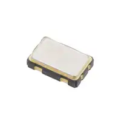

### Style 2

> Also acceptable, more markdown friendly

**External Distance Module**

1. Adafruit VL53L4CX Time of Flight Distance Sensor - ~1 to 6000mm - STEMMA QT / Qwiic

    

    * $14.95/each
    * [link to product](https://www.adafruit.com/product/5425?gad_source=1&gad_campaignid=21079227318&gbraid=0AAAAADx9JvSl8RUK5UpuGQcb53-oEMddy&gclid=Cj0KCQiA-YvMBhDtARIsAHZuUzJpbgO8iYHooJXRqa52AmxdyV115lKm72l8DtRN0tQkdX5DKgdkqPMaAj8PEALw_wcB)

    | Pros                                      | Cons                                                             |
    | ----------------------------------------- | ---------------------------------------------------------------- |
    | Inexpensive                               | Daughter Board |
    | Long Range(Up to 6m)                    |real world range depeds on reflectivity and ambiant light                                        |
    |  |

2. Adafruit VL53L1X Time of Flight Distance Sensor - ~30 to 4000mm - STEMMA QT / Qwiic

    

    * $14.95/each
    * [Link to product](https://www.adafruit.com/product/3967?gad_source=1&gad_campaignid=21079227318&gbraid=0AAAAADx9JvQBEa_pZJ0CxJy2nNGHELEVm&gclid=EAIaIQobChMIj6OwhJTSkgMVZQbvAh11ji6SEAQYASABEgJPGvD_BwE)

    | Pros                                                              | Cons                |
    | ----------------------------------------------------------------- | ------------------- |
    | Used commonly                                      | shorter max range then LC4CX      |
    | still long range                               | Daughter board |
    | |

3. Adafruit VL53L4CXV0DH/1 

    

    * $14.95/each
    * [Link to product](https://www.adafruit.com/product/3967?gad_source=1&gad_campaignid=21079227318&gbraid=0AAAAADx9JvQBEa_pZJ0CxJy2nNGHELEVm&gclid=EAIaIQobChMIj6OwhJTSkgMVZQbvAh11ji6SEAQYASABEgJPGvD_BwE)

    | Pros                                                              | Cons                |
    | ----------------------------------------------------------------- | ------------------- |
    | smallest footprint                                    | too small to hand solder    |
    | lowest cost                               | needs careful alignment and mechanical design |
    |no daughter board |

**Choice:** Option 1:Adafruit VL53L4CX Time of Flight Distance Sensor

**Rationale:** A clock oscillator is easier to work with because it requires no external circuitry in order to interface with the PSoC. This is particularly important because we are not sure of the electrical characteristics of the PCB, which could affect the oscillation of a crystal. While the shipping speed is slow, according to the website if we order this week it will arrive within 3 weeks.

1. PIC18F47Q10

    

    * $10.19/each
    * [Link to product](https://www.microchip.com/en-us/product/pic18f47q10)

    | Pros                                                              | Cons                |
    | ----------------------------------------------------------------- | ------------------- |
    | No background Wifi stacks                                    | MPlab debugging workflow can be slow    |
    |Predictable                           | Toolchain issues |
    | Lower Power consumption|

2. ESP32

    

    * $14.95/each
    * [Link to product](https://www.adafruit.com/product/3967?gad_source=1&gad_campaignid=21079227318&gbraid=0AAAAADx9JvQBEa_pZJ0CxJy2nNGHELEVm&gclid=EAIaIQobChMIj6OwhJTSkgMVZQbvAh11ji6SEAQYASABEgJPGvD_BwE)

    | Pros                                                              | Cons                |
    | ----------------------------------------------------------------- | ------------------- |
    | Arduino Libraries available                                    | Complicates power budget   |
    | Immediate print debugging                              | Background tasks can affect timing  |
    |less intergration mismatch |

**Choice:** Option 1: ESP32

**Rationale:** A clock oscillator is easier to work with because it requires no external circuitry in order to interface with the PSoC. This is particularly important because we are not sure of the electrical characteristics of the PCB, which could affect the oscillation of a crystal. While the shipping speed is slow, according to the website if we order this week it will arrive within 3 weeks.
